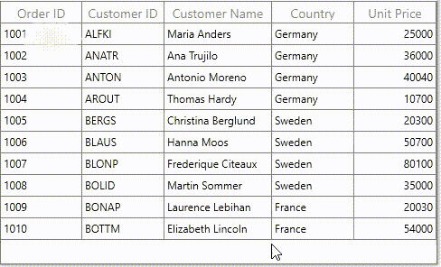

# How to apply the row mouse hover effect in WPF DataGrid(SfDataGrid)?

## About the sample
This example illustrates how to apply the row mouse hover effect in [WPF DataGrid](https://www.syncfusion.com/wpf-ui-controls/datagrid) (SfDataGrid)?

[WPF DataGrid](https://www.syncfusion.com/wpf-ui-controls/datagrid) (SfDataGrid) provide the direct support for change the background color when mouse hover. You can achieve this by enabling the [AllowRowHoverHighlighting](https://help.syncfusion.com/cr/cref_files/wpf/Syncfusion.SfGrid.WPF~Syncfusion.UI.Xaml.Grid.SfDataGrid~AllowRowHoverHighlighting.html) property and set the color by using [RowHoverHighlightingBrush](https://help.syncfusion.com/cr/cref_files/wpf/Syncfusion.SfGrid.WPF~Syncfusion.UI.Xaml.Grid.SfDataGrid~RowHoverHighlightingBrush.html) property in [WPF DataGrid](https://help.syncfusion.com/cr/cref_files/wpf/Syncfusion.SfGrid.WPF~Syncfusion.UI.Xaml.Grid.SfDataGrid.html) (SfDataGrid).

```XML
<syncfusion:SfDataGrid x:Name="sfDataGrid"
                               AllowRowHoverHighlighting="True"
                               RowHoverHighlightingBrush="Yellow"
                               AllowResizingColumns="True"
                               ColumnSizer="Star"                              
                               ItemsSource="{Binding Orders}"                                                             
                               AutoGenerateColumns="False">
           <syncfusion:SfDataGrid.Columns>
                <syncfusion:GridTextColumn HeaderText="Order ID" MappingName="OrderID"/>
                <syncfusion:GridTextColumn HeaderText="Customer ID" MappingName="CustomerID" />
                <syncfusion:GridTextColumn HeaderText="Customer Name" MappingName="CustomerName" />
                <syncfusion:GridTextColumn HeaderText="Country" MappingName="Country" />
                <syncfusion:GridTextColumn HeaderText="Unit Price" MappingName="UnitPrice" TextAlignment="Right"/>
            </syncfusion:SfDataGrid.Columns>
</syncfusion:SfDataGrid>

```



## Requirements to run the demo
Visual Studio 2015 and above versions

