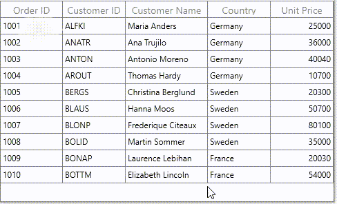

# How to Apply the Row mouse Hover Effect in WPF DataGrid?

This example illustrates how to apply the row mouse hover effect in [WPF DataGrid](https://www.syncfusion.com/wpf-controls/datagrid) (SfDataGrid).

`DataGrid` provide the direct support for change the background color when mouse hover. You can achieve this by enabling the [AllowRowHoverHighlighting](https://help.syncfusion.com/cr/wpf/Syncfusion.UI.Xaml.Grid.SfDataGrid.html#Syncfusion_UI_Xaml_Grid_SfDataGrid_AllowRowHoverHighlighting) property and set the color by using [RowHoverHighlightingBrush](https://help.syncfusion.com/cr/wpf/Syncfusion.UI.Xaml.Grid.SfDataGrid.html#Syncfusion_UI_Xaml_Grid_SfDataGrid_RowHoverHighlightingBrush) property in `DataGrid`.

```XML
<syncfusion:SfDataGrid x:Name="sfDataGrid"
                               AllowRowHoverHighlighting="True"
                               RowHoverHighlightingBrush="Yellow"
                               AllowResizingColumns="True"
                               ColumnSizer="Star"                              
                               ItemsSource="{Binding Orders}"                                                             
                               AutoGenerateColumns="False">
           <syncfusion:SfDataGrid.Columns>
                <syncfusion:GridTextColumn HeaderText="Order ID" MappingName="OrderID"/>
                <syncfusion:GridTextColumn HeaderText="Customer ID" MappingName="CustomerID" />
                <syncfusion:GridTextColumn HeaderText="Customer Name" MappingName="CustomerName" />
                <syncfusion:GridTextColumn HeaderText="Country" MappingName="Country" />
                <syncfusion:GridTextColumn HeaderText="Unit Price" MappingName="UnitPrice" TextAlignment="Right"/>
            </syncfusion:SfDataGrid.Columns>
</syncfusion:SfDataGrid>

```


